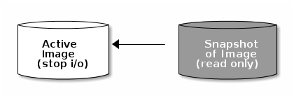
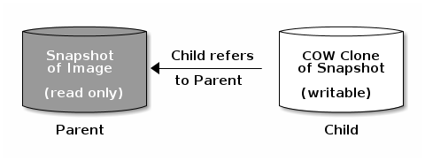

CEPH BLOCK DEVICE¶


## 1. Defined 
- Một block là một chuỗi byte ( 512 byte là một block data. ). Block storage là  phương thức lưu trữ dữ liệu giống như  hard disks, CD, floppy disks. 
- RBD được hỗ trực thực tiếp trong Linux kernel,  các RBD driver đã được tích hợp trong Linux kernel từ bản 2.6.34 trở lên .

- Cơ chế block storage trong Ceph là thin-provisioned, có khả năng co giãn, lưu trữ dữ liệu được chia nhỏ trên nhiều OSD. Ceph block storage tận dụng khả năng của RADOS : snapshot, replication, và tính nhất quán của dữ liệu, cơ chế copy on write, thin provisioning 

cd 


- Ceph block device khả năng làm việc mà mở rộng m, khả năng hiệu năng cao  với Kernel Virtual Machine ( KVM ) , các cloud-based như Openstack, Cloudstack. Ngoài ra cá hypervisor khác gồm Vmware hay Hyper-V cũng sẽ hỗ trợ RBD trong thời gian sớm cho máy ảo của họ. 


- Một số trích dẫn
````
RBD provides reliable, distributed, and high performance block storage volumes to clients. RBD volumes are effectively striped over numerous objects scattered throughout the entire Ceph cluster, a strategy that is key for providing availability, durability, and performance to clients. The Linux kernel bundles a native RBD driver; thus clients need not install layered software to enjoy Ceph's block service. RBD also provides enterprise features including incremental (diff) and full-volume snapshots, thin provisioning, copy-on-write (COW) cloning, layering, and others. RBD clients also support in-memory caching, which can dramatically improve performance.
```


## 2. Khởi tạo  BLOCK DEVICE POOL


- Khởi tạo Pool
```
ceph osd pool create rbd_1 100 100 replicated

```

- Khởi dầu pool sử dụng bởi RBD
```
rbd pool init rbd_1
```


- Khởi tạo User cho phép làm việc với pool "rbd_1"
```
ceph auth get-or-create client.ceo mon 'profile rbd' osd 'profile rbd pool=rbd_1' -o /etc/ceph/ceph.client.qemu.keyring


```

- "Gives a user permissions to manipulate RBD images. When used as a Monitor cap, it provides the minimal privileges required by an RBD client application. When used as an OSD cap, it provides read-write access to an RBD client application."

- More : http://docs.ceph.com/docs/mimic/rados/operations/user-management/


- Tạo image trong pool
```
rbd create --size {megabytes} {pool-name}/{image-name}


rbd create --size 1024 rbd_1/image1
```


- Ceph hỗ trợ cơ chế thin privisioned block device, có nghĩa là các storage device sẽ không bị sử dụng khi các client lưu trữ data trên các block device. CEPH block device rất linh hoatj, có thể tăng hoặc giảm dung lượng các RBD trong hồ chứa. Các filesystem như XFS, Btrfs, EXT, ZFS hỗ trợ chơ chế resizing. XFS , Btrfs. Ext4 không hỗ trợ cơ chế shrinking . 

- Resize image
```
rbd resize --size 2048 --allow-shrink rbd_1/image1  ## tang size

rbd resize --size 100 --allow-shrink rbd_1/image1  ## giam size

```

- Xem danh sách Block device
```
rbd ls
```

- Xem xem sách block iamge  trong pool
```
rbd ls {pool_name}
```


- Xem info block iamge
```
rbd info rbd_1/image1
```

- Xoá một block image
```
rbd rm {pool-name}/{image-name}

```

- Chuyển block iamge vào cùng tạm xoá
```
rbd trash mv {pool-name}/{image-name}

```

- Xem các iamge đang ở vùng tạm xoá
```
rbd trash list
```

- Khôi phục block image ở vùng tạm xoá
```

rbd trash restore {pool_name}/{image_id}

```

## 3. Kernel Modules


- Tắt future
```
rbd feature disable rbd_1/image1 object-map fast-diff deep-flatten
```

- MAP image 
```
sudo rbd device map {pool-name}/{image-name} --id {user-name}

sudo rbd device map rbd_1 image1


```


- umap image
```
sudo rbd device unmap /dev/rbd/{poolname}/{imagename}

sudo rbd device unmap /dev/rbd/rbd_1/image1

```

## 4.Snapshot

- Snapshot là một bản copy các trạng thái ( ảnh trạng thaí ) của các image tại 1 thời điểm
- Việc snap dữ liệu nên được thực hiện khi I/O của iamge đang ở trạng thái nghỉ để đảm bảo bản snapshot nắm giữ được trạng thái mới nhất.  




- Khởi tạo snapshot
```
rbd snap create {pool-name}/{image-name}@{snap-name}

rbd snap create rbd_1/image1@snap1

```


- Xem list snapshot
```

rbd snap ls {pool_name}/{iamge-name}

rbd snap ls rbd_1/images
```


- Roolback snapshot
```
rbd snap rollback {pool-name}/{image-name}@{snap-name}

rbd snap rollback rbd_1/image1@snap1

```

- Xoá một snapshit
```
rbd snap rm rbd_1/image1@snap1
```

- Xoá tất cả các snapshot trên image
```
rbd snap purge rbd_1/image1
```

## 5.Snapshot layering


- Tìm hiểu COW : https://viblo.asia/p/tan-man-ve-copy-on-write-WrJvYKXBeVO
- CEPH hỗ trợ tạo nhiều bản copy-on-write ( COW ) clone trên một bản snapshot. Cho phép các client khởi tạo image nhanh từ các snap này . Ví dụ , khi có một image với Centos OS trên đó, muốn khởi tạo ra một Centos OS mới , chỉ cần khởi tạo một snapshot cho image, sau đó tạo ra nhiều bản COW trên snap đó. Các snapshot ở mode READ only nhưng có theẻ thực hiện một bản clone dựa trên quy chế COW để có thể ghi dữ liệu trên này. 

- Việc hỗ trợ cơ chế COW rất hữu ích cho cloud và ảo hoá . Thường CEPH sẽ giữ một bản OS/VM image và thực hiện protect một snap trên image này. Sau khi thực hiện request khởi tạo mấy ảo, RBD sẽ thực hiện clone các image OS snap này cho các máy ảo.  



- Từ một image hoàn chỉnh đến một COW clone xây dựng nên hệ thống phân  lớp ( layer ) trong một block device. Quá trình bắt đầu  : từ một iamge , khởi tạo snapshot trên một image, thực hiện bảo vệ image, sau đó thực hiện clone các snapshot dựa vào chơ chế COW


- Các bản clone của một snapshot  sẽ tham chiếu đến snapshot gốc , bao gồm poolID, imageID và SnapshotID. Việc gồm các poolID có nghĩa là có thể thực hiện clone snapshot từ một pool tới một image ở pool khác.
    1. Image Template : sử dụng làm master image và snapshot của nó  sẽ làm template cho các bản Clone. Ví dụ muốn có một template cho Ubuntu, thực hiện build một image Ubuntu, các user sẽ thực hiện snapshot và clone bản snapshot
    2. Extended Template : người dùng có thể thực hiện clone các image , sau đó cài thêm các package trên đây mà thực hiện snapshot , và clone từ image này ( image đã đươcm mở rộng so với image gốc. )
    3. Template Pool: một cách khác để xây dựng block layer là khởi tạo một pool chứa các image gốc( các image template), snapshot các template này. Người dùng với quyền read-only trong pool hoàn toàn cói thể thực hiện clone snapshot và không cần quyền write và execute trong pool
    4. Image Migration/Recovery:  


- Khởi tạo image
```
rbd create --sie M/G/T {pool-name}/{image-name}
rbd create --size 1024M rbd_1/image2
```

- Khởi tạo snapshot
```
rbp snap create {pool-name}/{image-name}@{snap-name}

rbd snap create rbd_1/image2@snap1
```

- Protect snapshot
```
rbp snap protect {pool-name}/{image-name}@{snap-name}

rbd snap protect rbd_1/image2@snap1
```

- Clone snapshot
```
rbd clone {pool-name}/{image-name}@{snap-name}


rbd clone rbd_1/image2@snap1 rbd_1/image2_cloned

```

- List các bản clone của snapshot
```
rbd children {pool-name}/{image-name}@{snapshot-name}

rbd children rbd_1/image2@snap1
```

- Để xoá được snapshot cần xoá các bản clone sau dó unprotect snapshot
```

rbd rm {pool-name}/{image-clone}
rbd rm rbd_1/image2_cloned


rbd snap unprotect {pool-name}/{image-name}@{snapshot-name}

rbd snap unprotect rbd_1/image2@snap1

rbd snap rm  {pool-name}/{image-name}@{snapshot-name}

```

- Ngoài ra có thể xoá các snap sau khi đã thực hiện `flattened`. Nhằm copy các data từ snapshot gốc sang các clone image
```
rbd flatten {pool-name}/{image-clone}

rbd flatten {pool-name}/{image-clone}

```


