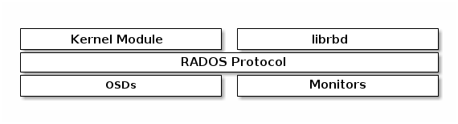

CEPH BLOCK DEVICE¶


## 1. Defined 
- Một block là một chuỗi byte ( 512 byte là một block data. ). Block storage là  phương thức lưu trữ dữ liệu như CD, floppy disks. 

- Cơ chế block storage trong Ceph là thin-provisioned, có khả năng co giãn, lưu trữ dữ liệu được chia nhỏ trên nhiều OSD. Ceph block storage tận dụng khả năng của RADOS : snapshot, replication, và tính nhất quán của dữ liệu 




## 2. Khởi tạo  BLOCK DEVICE POOL


- Khởi tạo Pool
```
ceph osd pool create rdb_1 150 150 replicated

```

- Khởi dầu pool sử dụng bởi RBD
```
rbd pool init rdb_1
```


- Khởi tạo User cho phép làm việc với pool "rdb_1"
```
ceph auth get-or-create client.qemu mon 'profile rbd' osd 'profile rbd pool=rdb_1' -o /etc/ceph/ceph.client.qemu.keyring


```

- "Gives a user permissions to manipulate RBD images. When used as a Monitor cap, it provides the minimal privileges required by an RBD client application. When used as an OSD cap, it provides read-write access to an RBD client application."

- More : http://docs.ceph.com/docs/mimic/rados/operations/user-management/


- Tạo iamge trong pool
```
rbd create --size {megabytes} {pool-name}/{image-name}


rbd create --size 1024 rdb_1/iamge1
```