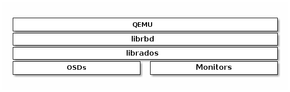
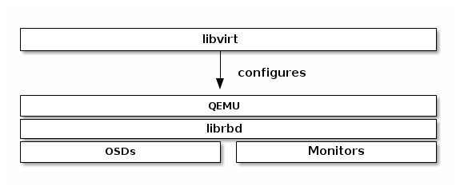

## 1. QEMU AND BLOCK DEVICES


- Ceph block storage được sử dụng để cung cấp các block image cho các máy ảo . Ví dụ có thể khởi tạo một snapshot từ một image , sau đó thực hiện clone nhiều bản trên snap này một cách nhanh chóng




- Ceph Block device có thể tích hợp trong  QEMU virutal machine. 
- QEMU command sẽ trỏ đến : /etc/ceph/$cluster.conf và client.admin  keyring khi thực hiện làm việc với RBD. 

- Thực hiện làm việc với RBD trên một node cài đặt QEMU-KVM và libvirt
```
yum install qemu-kvm ceph 

```


- Copy cấu hình và keyring từ OSD node sang node QEMU
```
scp /etc/ceph/ceph.conf root@ceph_gateway:/etc/ceph/ceph.conf
scp /etc/ceph/ceph.client.admin.keyring root@ceph_gateway:/etc/ceph/ceph.client.admin.keyring
```


- Khởi tạo image
```
qemu-img create -f raw rbd:{pool-name}/{image-name} {size}


qemu-img create -f raw rbd:rdb_1/image3 1G

```

- Resize image
```
qemu-img resize rbd:{pool-name}/{image-name} {size}


qemu-img resize rbd:rdb_1/image3 10G

```

- Xem info của block device
```
qemu-img info rbd:{pool-name}/{image-name}


qemu-img info rbfad:rdb_1/image3 
```


- Convert từ một image Centos7 của máy ảo thành block device image
```
wget https://cloud.centos.org/centos/7/images/CentOS-7-x86_64-GenericCloud-1503.qcow2

qemu-img convert -f qcow2 -O raw CentOS-7-x86_64-GenericCloud-1503.qcow2 rbd:rdb_1/cent-7

```

- Xem info disk
```
[root@ceph_gateway ~]# qemu-img info rbd:rdb_1/cent-7
image: rbd:rdb_1/cent-7
file format: raw
virtual size: 8.0G (8589934592 bytes)
disk size: unavailable

```

##  2 LIBVIRT WITH CEPH RBD

- Ceph hỗ trợ làm việc với QEMU/KVM thông qua soft interface libvirt. 



- Hầu hết libivrt làm việc với ceph block device để cung cấp cho các giải pháp cloud như Openstack hoặc Cloudstack. Các giải pháp cloud làm viẹc với libvirtd để làm viiệc với QEMU/KVM, QEMU/KVM làm việc với Ceph block device. thông qua librbd


## 2.1 Trên Node MON


- Khởi tạo Pool cho RBD
```
ceph osd pool create libvirt-pool 128 128
rbd pool init libvirt-pool
```
- Khởi tạo image với qemu
```
qemu-img create -f rbd rbd:libvirt-pool/os-data 10G
rbd -p libvirt-pool ls
```


- Khởi tạo client username : libvirt
```
ceph auth get-or-create client.libvirt mon 'allow r' osd 'allow class-read object_prefix rbd_children, allow rwx pool=libvirt-pool'

```

- Copy keyring sang node QEMU-libvirt
```
scp /etc/ceph/ceph.client.libvirt.keyring root@ceph_gateway:/etc/ceph/ceph.client.libvirt.keyring

```


## 2.2. Trên node QEMU - Libvirt

- Sau khi lab QEMU thành công, tiếp tục sử dụng môi trường sẵn  ( bao gồm CEPH,file cấu hình, key, QEMU- KVM) và cài thêm các package để làm việc với libvirt API


- Trên node  QEMU - Libvirt cài đặt packagefa
```
yum install -y  libvirt libvirt-python libguestfs-tools virt-install virt-viewer
systemctl start libvirtd
systemctl enable libvirtd
```


- Khởi tạo và define secret
```
cat > secret.xml <<EOF
<secret ephemeral='no' private='no'>
        <uuid>7a91dc24-b072-43c4-98fb-4b2415322b0f</uuid>
        <usage type='ceph'>
                <name>client.libvirt secret</name>
        </usage>
</secret>
EOF

virsh secret-define secret.xml
```

- Set key-value
```
ceph auth get-key client.libvirt | tee client.libvirt.key
virsh secret-set-value 7a91dc24-b072-43c4-98fb-4b2415322b0f --base64 $(cat client.libvirt.key)

```

- Get key user
```
#$ ceph auth ls
...
client.libvirt
	key: AQDeMt1cTokALxAAq5gSoCIX/Ukdcxg5tIDGbg==
	caps: [mon] allow r
	caps: [osd] allow class-read object_prefix rbd_children, allow rwx pool=libvirt-pool

```

- Lưu key
```
cat <<EOF >> /etc/ceph/keyring
[client.libvirt]
        key = AQDeMt1cTokALxAAq5gSoCIX/Ukdcxg5tIDGbg==
EOF
```

- Khởi tạo pool cho libvirt. Trường "<name>libvirt-pool</name>", sẽ là tên pool trên RBD đã được khởi tạo . UUID được định nghĩa bởi secret-define
```
cat > /tmp/ceph-libvirt-pool.xml <<EOF
<pool type='rbd'>
   <name>ceph-libvirt-pool</name>
   <source>
     <host name='192.168.30.143' port='6789'/>
     <name>libvirt-pool</name>
     <auth username='libvirt' type='ceph'>
       <secret type='ceph' uuid='7a91dc24-b072-43c4-98fb-4b2415322b0f'/>
     </auth>
   </source>
</pool>
EOF

virsh pool-undefine ceph-libvirt-pool

virsh pool-define /tmp/ceph-libvirt-pool.xml
virsh pool-start ceph-libvirt-pool
virsh pool-autostart ceph-libvirt-pool

```

- ### Hết cấu hình pool  Authen


- Wget ISO
```
wget https://mirrors.edge.kernel.org/centos/7.6.1810/isos/x86_64/CentOS-7-x86_64-Minimal-1810.iso -O /var/lib/libvirt/images/Centos-7.iso

```


- Sau khi cấu hình xong pool, libvirt sẽ xuất hiện một pool mới mang tên : ceph-libvirt-pool

- Khởi động máy ảo
```
virt-install \
--virt-type=kvm \
--name centos7 \
--ram 1024 \
--disk size=10,pool=ceph-libvirt-pool  \
--vcpus 1 --os-type linux \
--os-variant=centos7.0 \
--graphics vnc \
--cdrom=/var/lib/libvirt/images/Centos-7.iso 
```

- Dump cấu hình máy ảo
```
virsh dump centos7
...

<devices>
    <emulator>/usr/libexec/qemu-kvm</emulator>
    <disk type='file' device='disk'>
      <driver name='qemu' type='qcow2'/>
      <source file='/var/lib/libvirt/images/centos7_2.qcow2'/>
      <target dev='vda' bus='virtio'/>
      <boot order='1'/>
      <address type='pci' domain='0x0000' bus='0x00' slot='0x06' function='0x0'/>
    </disk>
...

</devices>

...
```

- Thêm Ceph image dưới dạng disk của máy ảo, xoá disk device cũ của máy ảo . 
```
virsh edit centos7
...
<devices>
    <emulator>/usr/libexec/qemu-kvm</emulator>
    <disk type='network' device='disk'>
        <source protocol='rbd' name='libvirt-pool/os-data'>
                <host name='192.168.30.145' port='6789'/> ## change IP monitor of Ceph cluster
        </source>
        <target dev='vda' bus='virtio'/>
    </disk>
...

</devices>
```


