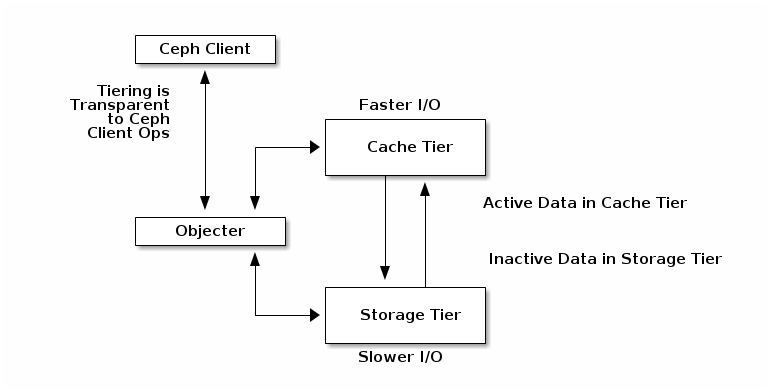

## 1. CEPH Cache

- Tầngf Cache cho phép CEPH client khả năng trăng hiệu suất I/O.. Ceph cache thực hiện khởi tạo pool đặt trên các deivce có hiệu năng cao, sau đó sẽ cấu hình cho pool này hoạt động như một lớp cache, và sẽ cấu hình các pool còn lại trên các device  có hiệu tăng thấp để  lưu trữ dữ liệu thực. CEPH object sẽ được xử lý thời gian lưu trữ trong tầng cache và chuyển sang phần lưu trữ dữ liệu chính thống. 




- Cache agent sẽ xử lý các migration data giữa tầng cache, và tầng backend một cách tự động hoặc thủ công. Sẽ có 2 kịch bản chính có thể xẩy ra
    - Writeback Mode : khi cấu hình ở mode writeback, Ceph client sẽ viết data xuống tầng cache. Tại thời điểm này, data đã được viết sẽ chuyển theo giờ gian từ tầng cache sang tầng backend. Tầng cache sẽ là fronend cho tầng backend. Khi client cần thực hiện write data, cache agent sẽ chuyển data sang tầng cache . Vì vậy việc client access data sẽ được sử dụng khả năng, hiệu suất của tầng cache với các device hiệu năng cao . 
    - Read-only-mode : khi cấu hình ở mode read-only,Client sẽ viêt data thằng vào tầng backend. Khi thực hiện đọc dữ liệu, dữ liệu sẽ được đẩy lên tầng cache. 

- Để xây dựng cache , cần có 2 pool tham gia bao gồm  backing pool và cache pool .

- Khởi tạo 1 lớp cache
```
ceph osd tier add {storagepool} {cachepool}

```


- More  : https://access.redhat.com/documentation/en-us/red_hat_ceph_storage/1.3/html/storage_strategies_guide/cache_tiering_tech_preview

## CEPH RBD Cache .

- CEPH sẽ sử ddụng bộ cache của riêng nó thay vì sử dụng Linux page cache , cơ thế được sử dụng bởi RBD là write-back caching. 


- Cấu hình cache
```

```
