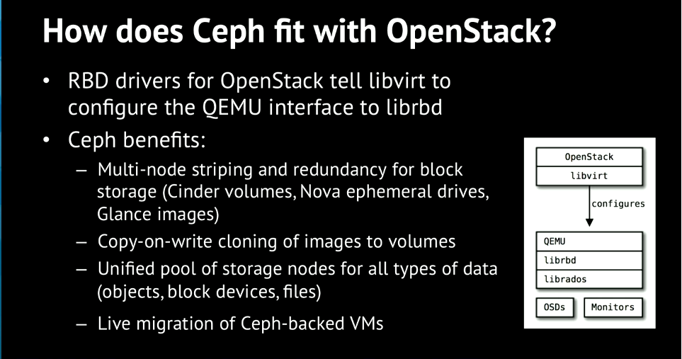

## 1. CEPH BLOCK DEVICES AND OPENSTACK ( VOLUME )

- Có thể sử dụng Ceph Block Device với Openstack thông qua libvirt .Để Ceph block device có thể  làm việc OPS, cần cài đặt QEMU, libivrt, và OPS hoàn chỉnh . 


- Có 3 phần  phần của Openstack có thể tích hợp với Ceph block device. 
    -  images : Openstack Glance, Image template cho các VM . 
    -  volume : là các block device. Openstack sử dụng volume để boot cho các VM  hoặc để attach vào các VM . OPENSTACK CINDER sẽ quản lý các volume này .  Các block này được quản lý bởi cinder-volume. Tích hợp CEPH vào cinder-volume, có nghiac ceph đang là backend trong cinder. Các voluem được khởi tạo sẽ là các object trong hồ chứa  
    -  Guest Disk : guest disk hay là guest opera system disk .Mặc định khi boot mootrj máy ảo, một disk của VM sẽ xuất hiện dưới dạng file trên hypervisor host (thông thường /var/lib/nova/instances/<uuid>/).Trước bản OPS Havana, cách duy nhất để  boot một VM trên CEPH là sử dụng chức năng boot-volume trên Cinder. Tuy nhiên , hiện tại đã có thể boot máy ảo trực tiếp lên CEPH mà không cần Cinder, cho phép live migration nhanh chóng các VM. , cũng như làm việc với `  nova evacuate` dễ dàng hơn. 


- Có thể sử dụng Openstack Glance để lưu trữ iamge trên Ceph block device, sử dụng Cinder để boot VM từ một clone snapshot ( clone image ), dựa vào cơ chế copy-on-write. 

fa
- CEPH không hỡ trợ QCOW2 để lưu trữ máy ảo. Vì vậy để boot VM , Glance image phải được format về dạng RAW

- Trong tài liệu này sẽ cấu hình Glance, Cinder, Nova. 




## 2. Khởi tạo Pool  trên ceph clusster

- Cấu hình file host
```
cat <<EOF >> /etc/hosts
# controller 1
192.168.50.121 controller1
# controller 2
192.168.50.122 controller2
# controller 3
192.168.50.123 controller3
# compute 1
192.168.50.124 compute1
# compute 2
192.168.50.125 compute2

EOF
```


- Khởi tạo pool
```
ceph osd pool create volumes 10
ceph osd pool create images 10
ceph osd pool create backups 10
ceph osd pool create vms 10
```

- Init pool
```
rbd pool init volumes
rbd pool init images
rbd pool init backups
rbd pool init vms
```

- Copy cấu hình sang các OPS Node ( controller, compute )
```
ssh {your-openstack-server} sudo tee /etc/ceph/ceph.conf </etc/ceph/ceph.conf

```

## 3. Cài đặt và cấu hình CEPH client 

### 3.1. Cài đặt package

- Khởi tạo Repository trên tất cả các node 
```
cat <<EOF> /etc/yum.repos.d/ceph.repo
[ceph]
name=Ceph packages for $basearch
baseurl=https://download.ceph.com/rpm-mimic/el7/x86_64/
enabled=1
priority=2
gpgcheck=1
gpgkey=https://download.ceph.com/keys/release.asc

[ceph-noarch]
name=Ceph noarch packages
baseurl=https://download.ceph.com/rpm-mimic/el7/noarch
enabled=1
priority=2
gpgcheck=1
gpgkey=https://download.ceph.com/keys/release.asc

[ceph-source]
name=Ceph source packages
baseurl=https://download.ceph.com/rpm-mimic/el7/SRPMS
enabled=0
priority=2
gpgcheck=1
gpgkey=https://download.ceph.com/keys/release.asc
EOF
```


- Cài đặt EPEL Repository
```
yum install -y https://dl.fedoraproject.org/pub/epel/epel-release-latest-7.noarch.rpm
```

- Trên các node Glance-API
```
yum -y install --enablerepo=ceph python-rbd

```

- Trên các node nova-compute, cinder-backup và cinder-volume
```
yum install -y --enablerepo=ceph python-rbd
yum install -y --enablerepo=ceph ceph-common
```

- Cấu hình file host
```
cat <<EOF>> /etc/hosts

192.168.50.145 ceph_node1
192.168.50.146 ceph_node2
192.168.50.147 ceph_node3

EOF
```


### 3. Thực hiện khởi tạo user và copy cấu hình trên CEPH Cluster 


- Copy cấu hình từ MON sang các node glance-api, cinder-volume, nova-compute và cinder-backup 
```
scp /etc/ceph/ceph.conf {osp_node}:/etc/ceph
ssh {your-openstack-server} chmod 644 /etc/ceph/ceph.conf
```


- Khởi tạo user cho các User Glancer và Cinder, Cinder-Backup
```
ceph auth get-or-create client.cinder mon 'allow r' osd 'allow class-read object_prefix rbd_children, allow rwx pool=volumes, allow rwx pool=vms, allow rx pool=images'
ceph auth get-or-create client.glance mon 'allow r' osd 'allow class-read object_prefix rbd_children, allow rwx pool=images'
ceph auth get-or-create client.cinder-backup mon 'allow r' osd 'allow class-read object_prefix rbd_children, allow rwx pool=backups'
```


- Copy key các node glance-api, cinder-volume, nova-compute và cinder-backup 
```
ceph auth get-or-create client.glance | ssh {your-glance-api-server} sudo tee /etc/ceph/ceph.client.glance.keyring
ssh {your-glance-api-server} sudo chown glance:glance /etc/ceph/ceph.client.glance.keyring
ceph auth get-or-create client.cinder | ssh {your-volume-server} sudo tee /etc/ceph/ceph.client.cinder.keyring
ssh {your-cinder-volume-server} sudo chown cinder:cinder /etc/ceph/ceph.client.cinder.keyring
ceph auth get-or-create client.cinder-backup | ssh {your-cinder-backup-server} sudo tee /etc/ceph/ceph.client.cinder-backup.keyring
ssh {your-cinder-backup-server} sudo chown cinder:cinder /etc/ceph/ceph.client.cinder-backup.keyring


```

- Copy key cinder-volume sang các node nova-compute
```
ceph auth get-or-create client.cinder | ssh {your-nova-compute-server} sudo tee /etc/ceph/ceph.client.cinder.keyring

ceph auth get-key client.cinder | ssh {your-compute-node} tee /tmp/client.cinder.key

```

## 4. Cấu hình Libvirt trên các compute node

- Thực hiện cấu hình trên các compute node 

```
uuidgen
691c3607-7ca3-433a-a0c0-5805cea8afa0

cat > secret.xml <<EOF
<secret ephemeral='no' private='no'>
  <uuid>691c3607-7ca3-433a-a0c0-5805cea8afa0</uuid>
  <usage type='ceph'>
    <name>client.cinder secret</name>
  </usage>
</secret>
EOF


sudo virsh secret-define --file secret.xml

sudo virsh secret-set-value --secret 691c3607-7ca3-433a-a0c0-5805cea8afa0 --base64 $(cat /tmp/client.cinder.key) 
rm -f /tmp/client.cinder.key  secret.xml
```


##  5. Cấu hình cho phép Openstack access vào CEPH


### 5.1. Cấu hình Cinder-volume ( Test OK - Volume ) ( HA : Volume group service )

- Đối với `rbd_secret_uuid` sử dụng secret được định nghĩa trong libvirt trên các nova-compute node

- Cấu hình tại : /etc/cinder/cinder.conf. 
```
[DEFAULT]
enabled_backends = ceph

glance_api_version = 2

[ceph]
volume_driver = cinder.volume.drivers.rbd.RBDDriver
volume_backend_name = ceph
rbd_pool = volumes
rbd_ceph_conf = /etc/ceph/ceph.conf
rbd_flatten_volume_from_snapshot = false
rbd_max_clone_depth = 5
rbd_store_chunk_size = 4
rados_connect_timeout = -1
rbd_user = cinder
rbd_secret_uuid = 691c3607-7ca3-433a-a0c0-5805cea8afa0
```


### 5.2 : Cấu hình Cinder Backup  (test ok )


- Cấu hình bổ sung tại section [DEFAULT ]
```
[DEFAULT]
......

backup_driver = cinder.backup.drivers.ceph
backup_ceph_user = cinder-backup
backup_ceph_conf = /etc/ceph/ceph.conf
backup_ceph_chunk_size = 134217728
backup_ceph_pool = backups
backup_ceph_stripe_unit = 0
backup_ceph_stripe_count = 0
restore_discard_excess_bytes = true
```


### 5.3 : Cấu hình Glance API  ( test ok )


- Cấu hình tại Section [glance_store]
```
[DEFAULT]
show_image_direct_url = True

[glance_store]
stores = rbd
default_store = rbd
rbd_store_chunk_size = 8
rbd_store_pool = images
rbd_store_user = glance
rbd_store_ceph_conf = /etc/ceph/ceph.conf
```


### 5.4 :  Cấu hình trên các Nova-compute node ( Guest Disk ) 


- Thêm section client trên file cấu hình
```
vim /etc/ceph/ceph.conf

[client]
rbd cache = true
rbd cache writethrough until flush = true
rbd concurrent management ops = 20
admin socket = /var/run/ceph/guests/$cluster-$type.$id.$pid.$cctid.asok
log file = /var/log/ceph/qemu-guest-$pid.log
```

- Phân quyền
```
mkdir -p /var/run/ceph/guests/ /var/log/ceph/
chown qemu:libvirt /var/run/ceph/guests /var/log/ceph/
```

- Cấu hình libvirt tại /etc/nova/nova.conf
```
vim /etc/nova/nova.conf

[libvirt]
images_type = rbd
images_rbd_pool = vms
images_rbd_ceph_conf = /etc/ceph/ceph.conf
rbd_user = cinder
rbd_secret_uuid = 691c3607-7ca3-433a-a0c0-5805cea8afa0
disk_cachemodes="network=writeback"
inject_password = false
inject_key = false
inject_partition = -2
live_migration_flag="VIR_MIGRATE_UNDEFINE_SOURCE,VIR_MIGRATE_PEER2PEER,VIR_MIGRATE_LIVE,VIR_MIGRATE_PERSIST_DEST,VIR_MIGRATE_TUNNELLED"
hw_disk_discard = unmap
```

### 5.5. KHỞI ĐỘNG DỊCH VỤ

```
systemctl restart openstack-cinder-volume
systemctl restart openstack-cinder-backup
systemctl restart openstack-glance-api
systemctl restart openstack-nova-compute

systemctl status openstack-cinder-volume
systemctl status openstack-cinder-backup
systemctl status openstack-glance-api
systemctl status openstack-nova-compute
```

### 5.6. Khởi tạo image

- Để boot dược các VM trên RBD, các Glance image phải ở định dạng RAW. 

```
wget https://cloud.centos.org/centos/7/images/CentOS-7-x86_64-GenericCloud-1503.qcow2
qemu-img convert -f qcow2 -O raw CentOS-7-x86_64-GenericCloud-1503.qcow2 CentOS-7-x86_64-GenericCloud-1503.raw
openstack image create --file CentOS-7-x86_64-GenericCloud-1503.raw --disk-format raw --container-format bare --min-disk 8 --public Centos7

openstack image set \
    --property hw_scsi_model=virtio-scsi \
    --property hw_disk_bus=scsi \
    --property hw_qemu_guest_agent=yes \
    --property os_require_quiesce=yes Centos7
```


## 6. Glance Image COW và RBD Layering

- Cấu hình trên Glance 
```
[DEFAULT]
show_image_direct_url = True

```

- Khởi tạo image
```
wget https://cloud.centos.org/centos/7/images/CentOS-7-x86_64-GenericCloud-1503.qcow2

qemu-img convert -f qcow2 -O raw CentOS-7-x86_64-GenericCloud-1503.qcow2 CentOS-7-x86_64-GenericCloud-1503.raw
openstack image create --file CentOS-7-x86_64-GenericCloud-1503.raw --disk-format raw --container-format bare --min-disk 8 --public Centos7
openstack image set \
    --property hw_scsi_model=virtio-scsi \
    --property hw_disk_bus=scsi \
    --property hw_qemu_guest_agent=yes \
    --property os_require_quiesce=yes Centos

```

- Sau khi image Centos7 được đẩy lên Glance, kiểm tra thông số 
```
# glance image-show a6f31c31-9608-4a3b-8695-ef220bcb4608
+------------------+----------------------------------------------------------------------------------+
| Property         | Value                                                                            |
+------------------+----------------------------------------------------------------------------------+
| checksum         | 9324f9af2494dd101b5173484e37c969                                                 |
| container_format | bare                                                                             |
| created_at       | 2019-07-04T09:54:59Z                                                             |
| direct_url       | rbd://efde9ca7-5b57-4ed6-ae01-8cb3befe5bac/images/a6f31c31-9608-4a3b-8695-ef220b |
|                  | cb4608/snap                                                                      |
| disk_format      | raw                                                                              |
| id               | a6f31c31-9608-4a3b-8695-ef220bcb4608                                             |
| min_disk         | 8                                                                                |
| min_ram          | 0                                                                                |
| name             | Centos7                                                                          |
| os_hash_algo     | sha512                                                                           |
| os_hash_value    | e0f27754e2c8742bcf731cef37e5f17d9eb05e2c03fc5da1fac45aa992057ac016c0d5aa40070c89 |
|                  | abd74ea3076eb7ff4c5c5a3d988d74f596fdf7546122bf8f                                 |
| os_hidden        | False                                                                            |
| owner            | c207b2c8d4124077acd560d9e37e80eb                                                 |
| protected        | False                                                                            |
| size             | 8589934592                                                                       |
| status           | active                                                                           |
| tags             | []                                                                               |
| updated_at       | 2019-07-04T10:02:14Z                                                             |
| virtual_size     | Not available                                                                    |
| visibility       | public                                                                           |
+------------------+----------------------------------------------------------------------------------+

```

- Trong image đã xuất hiện một property **direct_url** sử dụng rbd protocol . Kiểm tra trên CEPH, image đã có một bản snapshot, mà giá trị của direct_url trỏ về . Đường dẫn này sẽ là base image hay là parent image cho các image clone 
```
# rbd snap ls images/a6f31c31-9608-4a3b-8695-ef220bcb4608
SNAPID NAME  SIZE TIMESTAMP
     7 snap 8 GiB Thu Jul  4 17:02:14 2019

```

- Khởi tạo Volume từ image Centos7
```
# openstack volume create --image Centos7 --size 10 volume_cow

# cinder show volume_cow
+--------------------------------+-------------------------------------------------+
| Property                       | Value                                           |
+--------------------------------+-------------------------------------------------+
| attached_servers               | []                                              |
| attachment_ids                 | []                                              |
| availability_zone              | nova                                            |
| bootable                       | true                                            |
| consistencygroup_id            | None                                            |
| created_at                     | 2019-07-04T10:06:28.000000                      |
| description                    | None                                            |
| encrypted                      | False                                           |
| id                             | 1c738e51-7520-43a5-9c21-654b66c5772c            |
| metadata                       |                                                 |
| migration_status               | None                                            |
| multiattach                    | False                                           |
| name                           | volume_cow                                      |
| os-vol-host-attr:host          | cinder-cluster-1@ceph#ceph                      |
| os-vol-mig-status-attr:migstat | None                                            |
| os-vol-mig-status-attr:name_id | None                                            |
| os-vol-tenant-attr:tenant_id   | c207b2c8d4124077acd560d9e37e80eb                |
| replication_status             | None                                            |
| size                           | 10                                              |
| snapshot_id                    | None                                            |
| source_volid                   | None                                            |
| status                         | available                                       |
| updated_at                     | 2019-07-04T10:06:31.000000                      |
| user_id                        | 9abe25e4ca29404681ec9cde7b291992                |
| volume_image_metadata          | checksum : 9324f9af2494dd101b5173484e37c969     |
|                                | container_format : bare                         |
|                                | disk_format : raw                               |
|                                | image_id : a6f31c31-9608-4a3b-8695-ef220bcb4608 |
|                                | image_name : Centos7                            |
|                                | min_disk : 8                                    |
|                                | min_ram : 0                                     |
|                                | size : 8589934592                               |
| volume_type                    | None                                            |
+--------------------------------+-------------------------------------------------+

```

- Kiểm tra volume, sẽ thấy image đang là con của snapshot "images/a6f31c31-9608-4a3b-8695-ef220bcb4608@snap", và hiện tại đang sử dụng 8GB data từ snap 
```
# rbd ls volumes | grep 1c738e51-7520-43a5-9c21-654b66c5772c
volume-1c738e51-7520-43a5-9c21-654b66c5772c

rbd info volumes/volume-1c738e51-7520-43a5-9c21-654b66c5772c
rbd image 'volume-1c738e51-7520-43a5-9c21-654b66c5772c':
        size 10 GiB in 2560 objects
        order 22 (4 MiB objects)
        id: 9df566af094e
        block_name_prefix: rbd_data.9df566af094e
        format: 2
        features: layering, exclusive-lock, object-map, fast-diff, deep-flatten
        op_features:
        flags:
        create_timestamp: Thu Jul  4 17:06:30 2019
        parent: images/a6f31c31-9608-4a3b-8695-ef220bcb4608@snap
        overlap: 8 GiB

```

