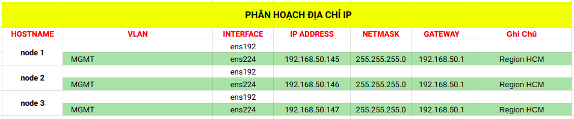

## Cài đặt Ceph ( Ceph-deploy )

## 1. Yêu cầu mà mô hình


### 1. Môi trường

- Yêu cầu phần cứng
 

- Môi trường
    - OS : Centos 7
    - User : root

### 1.2. Mô hình

- Mô hình ## chưa cập nhật 


- Network Plan ## chưa cập nhật 



- Lưu ý : hostname các Ceph node phải trùng với các bản ghi host .

## 2. Chuẩn bị môi trường


### 2.1. Cấu hình trên tất cả các CEPH Node và Client Node


- Cấu hình hostname
```
hostnamectl set-hostname {ceph_node1,ceph_node2,ceph_node3}
```

- Cài đặt package
```
yum install -y ntp ntpdate ntp-doc openssh-server 
yum install python-setuptools
systemctl start sshd
systemctl enable sshd
yum install -y yum-plugin-priorities 

```

- Cấu hình filehost
```
cat <<EOF> /etc/hosts

192.168.30.143 ceph_client
192.168.30.144 ceph_deploy
192.168.30.145 ceph_node1
192.168.30.146 ceph_node2
192.168.30.147 ceph_node3

EOF
```

- Khởi tạo CEPH user ( sử dụng cho deploy )
```
sudo useradd -d /home/ceph_deploy -m ceph_deploy
echo "ceph_deploy:123@123Aa" | chpasswd

echo "ceph_deploy ALL = (root) NOPASSWD:ALL" | sudo tee /etc/sudoers.d/ceph_deploy
sudo chmod 0440 /etc/sudoers.d/ceph_deploy
```

- Cấu hình FirewallD
```
firewall-cmd --add-port=6789/tcp --permanent 
firewall-cmd --add-port=6800-7100/tcp --permanent
firewall-cmd --reload  
```

- Cấu hình SeLinux
```
sed -i s/^SELINUX=.*$/SELINUX=permissive/ /etc/selinux/config
setenforce 0
```

- Cấu hình NTP
```
ntpdate -qu 0.centos.pool.ntp.org 1.centos.pool.ntp.org 2.centos.pool.ntp.org
systemctl start ntpd
systemctl enable ntpd
timedatectl set-ntp true 
hwclock  -w 
```

### 2.2. Cấu hình trên Node Deploy 


- Khởi tạo Repo
```
cat << EOM > /etc/yum.repos.d/ceph.repo
[ceph-noarch]
name=Ceph noarch packages
baseurl=https://download.ceph.com/rpm-mimic/el7/noarch
enabled=1
gpgcheck=1
type=rpm-md
gpgkey=https://download.ceph.com/keys/release.asc
EOM
```

- Cài đặt package
```
sudo yum install -y https://dl.fedoraproject.org/pub/epel/epel-release-latest-7.noarch.rpm
sudo yum update
sudo yum install -y ceph-deploy
```

- Cấu hình File hosts
```
cat <<EOF> /etc/hosts

192.168.30.143 ceph_client
192.168.30.144 ceph_deploy
192.168.30.145 ceph_node1
192.168.30.146 ceph_node2
192.168.30.147 ceph_node3

EOF
```


- Khởi tạo SSH-key trên user  `ceph_deploy` , copy sang  node2, node3
```
ssh-keygen
sudo ssh-copy-id ceph_deploy@ceph_node1
sudo ssh-copy-id ceph_deploy@ceph_node2
sudo ssh-copy-id ceph_deploy@ceph_node3
sudo ssh-copy-id ceph_deploy@ceph_client

```

- Cấu hình SSH config
```
$ vi  ~/.ssh/config

Host ceph_node1
   Hostname ceph_node1
   User ceph_deploy
Host ceph_node2
   Hostname ceph_node2
   User ceph_deploy
Host ceph_node3
   Hostname ceph_node3
   User ceph_deploy
Host ceph_client
   Hostname ceph_client
   User ceph_deploy

```

## 3. Cấu hình STORAGE CLUSTER 

- Mô hình cài đặt : 1 Ceph Monitor và 3 Ceph OSD Daemons


### 3.1. Cấu hình trên node Deploy 

- Sử dụng tài khoản `root`

- Gỡ các Ceph package và các cấu hình có sẵn
```
mkdir my-cluster ## chứa cấu hình và key để access vào cụm
cd my-cluster
ceph-deploy --username ceph_deploy purge ceph_node1 ceph_node2 ceph_node3
ceph-deploy --username ceph_deploy purgedata ceph_node1 ceph_node2 ceph_node3  
ceph-deploy --username ceph_deploy forgetkeys 
rm -rf ceph.*

```

- Khởi tạo cluster mới 
```
ceph-deploy new {initial-monitor-node(s)} ## cau truc
ceph-deploy new ceph_node1 

```

- Để khởi tạo được Cluster , yêu cầu ít nhất 1 node. Sau khi khởi động Cluster, trên node chính sẽ xuất file tại thư mục hiện tại `A Ceph configuration file`, `monitor keyring`. Thực hiện các command tại thư mục này

- http://docs.ceph.com/docs/mimic/rados/deployment/ceph-deploy-new/


- Việc thực hiện các command dưới dây sử dùng file cấu hình mặc định `ceph.conf`và key tại thư mục hiện tại . Có  thể sử dụng option `--ceph-conf` để chỉ định file cấu hình


- faceA public network over which clients access data. MON and OSD nodes also communicate across the public network.
- A private network used only for replication and recovery among OSD nodes, also known as the cluster, backend, or replication network. It is advised for this network to not have a gateway.


- Cấu hình Network - Public Network và Cluster Network ( tham khảo thêm : http://docs.ceph.com/docs/mimic/rados/configuration/network-config-ref/) trên file `ceph.conf`
```Failed to execute command: yum -y install ceph ceph-radosgw

$ vi ceph.conf ## example
[global]
        # ... elided configuration
        mon_host = {ceph_node1-public-network-ip/netmask}
        public network = {public-network/netmask}   
        cluster network = {cluster-network/netmask}


$ vi ceph.conf
[global]
        # ... elided configuration
        public network = 192.168.30.0/24   
        cluster network =  192.168.50.0/24   


```

- Ceph Monitors listen on port 6789 by default. Additionally, Ceph Monitors always operate on the public network.


- Cài đặt Ceph package trên các node
```
ceph-deploy install ceph_node1 ceph_node2 ceph_node3

```

- Kiểm tra version cài đặt
```
ceph --version

```

- Khởi động MON daemon  `ceph_node1` và đồng bộ key trên
```
ceph-deploy mon create-initial  ## khoi dong mon chep key sang node 1
```

- Format các key boostrap sau khi được khởi tạo
```
ceph.client.admin.keyring
ceph.bootstrap-mgr.keyring
ceph.bootstrap-osd.keyring
ceph.bootstrap-mds.keyring
ceph.bootstrap-rgw.keyring
ceph.bootstrap-rbd.keyring
```

- Sử dụng `ceph deploy admin` để copy cấu hình và  client.admin tới các Ceph node. Các key được  lấy ` {cluster}.client.admin.keyring ` từ node deploy sẽ được đưa  node xuống thư mục ` /etc/ceph ` các Ceph node. Khi sử dụng ceph cli trên các ceph sẽ không cần chỉ định key trong tương lai
```
ceph-deploy admin ceph_node1 ceph_node2 ceph_node3

```

## 4. Cấu hình mở rộng

- Các CEPH cluster yêu cầu có ít nhất 1 monitor và 1 manager  để có thể hoạt động . Để sử dụng tính khả dụng cao cho cụn, Ceph storage Cluster thường chạy nhiều Ceph monitor giúp hạn chế  khi một điểm monitor chết sẽ không ảnh hướng hoạt động đến cả cụm Ceph sử dụng  Paxos algorithm, thiết lập chỉ số qourum cho cụm dựa vá số các monitor , thường ( N /2 , với N là số monitor ) 


- Thêm manager deamon
```
ceph-deploy mgr create ceph_node1 ceph_node2 ceph_node3
```

- Thêm Ceph metadata server vào `ceph_node1`
```
ceph-deploy mds create ceph_node1

```

- Thêm Monitor `ceph_node2, ceph_node3`
```
ceph-deploy mon add ceph_node2
ceph-deploy mon add ceph_node3

```

- Thêm ODS trên 3 Ceph Node
```
ceph-deploy osd create --data {device} {ceph-node}


ceph-deploy osd create --data /dev/vdb ceph_node1
ceph-deploy osd create --data /dev/vdb ceph_node2
```


- Kiểm trang trạng thái cluster
```bash
$   ssh ceph_node1 sudo ceph health
HEALTH_OK
```


- Xem thêm thông tin về cluster
```bash
$ ssh ceph_node1 sudo ceph -s
  cluster:
    id:     d7221774-ee41-4cf7-a337-dd5c8f776573
    health: HEALTH_OK
 
  services:
    mon: 3 daemons, quorum ceph_node1,ceph_node2,ceph_node3
    mgr: ceph_node1(active), standbys: ceph_node2, ceph_node3
    osd: 3 osds: 3 up, 3 in
 
  data:
    pools:   0 pools, 0 pgs
    objects: 0  objects, 0 B
    usage:   3.0 GiB used, 147 GiB / 150 GiB avail
    pgs:     
 

```

- Xem trạng tháo quorum 
```
$ ssh ceph_node1 sudo ceph quorum_status --format json-pretty

{
    "election_epoch": 12,
    "quorum": [
        0,
        1,
        2
    ],
    "quorum_names": [
        "ceph_node1",
        "ceph_node2",
        "ceph_node3"
    ],
    "quorum_leader_name": "ceph_node1",
    "monmap": {
        "epoch": 3,
        "fsid": "d7221774-ee41-4cf7-a337-dd5c8f776573",
        "modified": "2019-04-20 09:11:15.392286",
        "created": "2019-04-20 09:09:33.384727",
        "features": {
            "persistent": [
                "kraken",
                "luminous",
                "mimic",
                "osdmap-prune"
            ],
            "optional": []
        },
        "mons": [
            {
                "rank": 0,
                "name": "ceph_node1",
                "addr": "192.168.30.145:6789/0",
                "public_addr": "192.168.30.145:6789/0"
            },
            {
                "rank": 1,
                "name": "ceph_node2",
                "addr": "192.168.30.146:6789/0",
                "public_addr": "192.168.30.146:6789/0"
            },
            {
                "rank": 2,
                "name": "ceph_node3",
                "addr": "192.168.30.147:6789/0",
                "public_addr": "192.168.30.147:6789/0"
            }
        ]
    }
}

```


## 4. Truy cập dữ liệu


- Khởi động một  RADOS gateway interface, cho phép truy cập vào các object data
```
ceph-deploy rgw create {gateway-node}

ceph-deploy rgw create ceph_node1

```

- Mặc định , RGW sử dụng port 7480, cấu hình về cổng `80` ( cấu hình trên  node rgw, node 1)
```
$ vi /etc/ceph/ceph.conf


[client]
rgw frontends = civetweb port=80

```

- Để lưu data dưới dạng object, yêu cầu cần có
    - Set an object name
    - Specify a pool
```


- Khởi tạo Pool, đẩy file testfile.txt lên pool
```
echo "du lieu test" > testfile.txt
ceph osd pool create mytest 8

rados put {object-name} {file-path} --pool=mytest ##  example
rados put test-object-1 testfile.txt --pool=mytest
```

- Kiểm tra dữ liệu đã được lưu trữ trên pool
```
rados -p mytest ls

```

- Kiểm tra localtion của object
```
ceph osd map mytest test-object-1

```


- Liệt kê các pool
```
ceph osd lspools

```