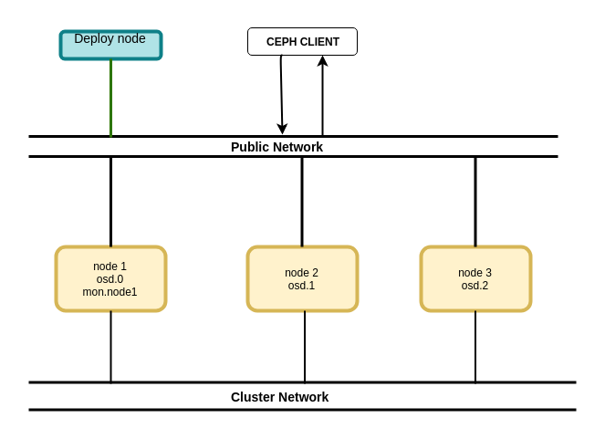

## Cài đặt Ceph ( Ceph-deploy )

## 1. Yêu cầu mà mô hình


### 1. Môi trường

- Yêu cầu phần cứng
 

- Môi trường
    - OS : Centos 7
    - User : root

### 1.2. Mô hình

- Mô hình ## chưa cập nhật 



- Network Plan ## chưa cập nhật 


## 2. Chuẩn bị môi trường


### 2.1. Cấu hình trên tất cả các Node

- Cài đặt package
```
yum install -y ntp ntpdate ntp-doc  openssh-server 
yum install python-setuptools
systemctl start sshd
systemctl enable sshd
yum install -y yum-plugin-priorities 

```

- Cấu hình filehost
```
cat <<EOF> /etc/hosts

192.168.50.145 node1
192.168.50.146 node2
192.168.50.147 node3

EOF
```

- Khởi tạo CEPH user ( sử dụng cho deploy )
```
sudo useradd -d /home/ceph_deploy -m ceph_deploy
echo "ceph_deploy:123@123Aa" | chpasswd

echo "ceph_deploy ALL = (root) NOPASSWD:ALL" | sudo tee /etc/sudoers.d/ceph_deploy
sudo chmod 0440 /etc/sudoers.d/ceph_deploy
```

- Cấu hình FirewallD
```
sudo firewall-cmd --zone=public --add-service=ceph-mon --permanent
sudo firewall-cmd --zone=public --add-service=ceph --permanent
sudo firewall-cmd --reload
```

- Cấu hình SeLinux
```
sed -i s/^SELINUX=.*$/SELINUX=permissive/ /etc/selinux/config
setenforce 0
```


### 2.2. Cấu hình trên Node Deploy ( Node 1 )


- Khởi tạo Repo
```
cat << EOM > /etc/yum.repos.d/ceph.repo
[ceph-noarch]
name=Ceph noarch packages
baseurl=https://download.ceph.com/rpm-mimic/el7/noarch
enabled=1
gpgcheck=1
type=rpm-md
gpgkey=https://download.ceph.com/keys/release.asc
EOM
```

- Cài đặt package
```
sudo yum install -y https://dl.fedoraproject.org/pub/epel/epel-release-latest-7.noarch.rpm
sudo yum update
sudo yum install -y ceph-deploy
```

- Khởi tạo SSH-key trên user  `ceph_deploy` , copy sang  node2, node3
```
ssh-keygen
sudo ssh-copy-id ceph_deploy@node1
sudo ssh-copy-id ceph_deploy@node2
sudo ssh-copy-id ceph_deploy@node3
```


```
## 3. Cấu hình STORAGE CLUSTER 

- Mô hình cài đặt : 1 Ceph Monitor và Ceph OSD Daemons


### 3.1. Cấu hình trên node Deploy ( node 1)

- Sử dụng tài khoản `root`

- Gỡ các Ceph package và các cấu hình có sẵn
```
mkdir my-cluster
cd my-cluster
ceph-deploy --username ceph_deploy purge node1 node2 node3 
ceph-deploy --username ceph_deploy purgedata node1 node2 node3  
ceph-deploy --username ceph_deploy forgetkeys 
rm ceph-.*

```

- Khởi tạo cluster mới
```
ceph-deploy new {initial-monitor-node(s)} ## cau truc
ceph-deploy new node1


```